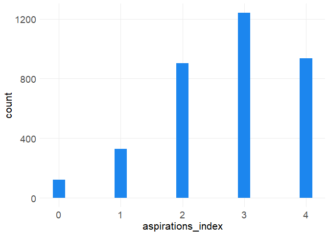

Untitled
================

toc: true toc\_depth:3 toc\_float: true number\_sections: true theme:
paper fig.caption: true fig.height: 4 fig.width: 6 df\_print: kable
code\_folding: true

``` r
describe(dat$aspirations_index)
```

          ┌──────────────────────────────────────────────────────────
          │ vars          n   mean     sd   median   trimmed    mad  
          ├──────────────────────────────────────────────────────────
          │    1   3.53e+03   2.72   1.06        3      2.82   1.48  
          └──────────────────────────────────────────────────────────

Column names: vars, n, mean, sd, median, trimmed, mad, min, max, range,
skew, kurtosis, se

7/13 columns shown.

``` r
#getwd()
#here()
```

``` r
ggplot(dat, aes(aspirations_index)) + 
  geom_bar(width=.2, fill="dodgerblue2")
```

<!-- -->
